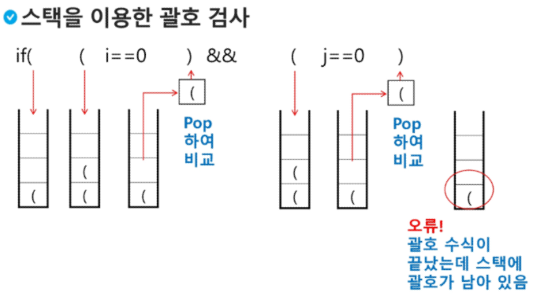

# 0806 스택1
1. 스택
2. 재귀호출
3. 재귀호출 연습
4. Memoization
5. Dp
6. DFS  

## 1. 스택
1. 연산
   - 삽입: push
   - 삭제: pop
   - 스택이 공백인지 아닌지를 확인하는 연산 .isEmpty
   - 스택의 top에 있는 item(원소)을 반환하는 연산.peek
2. 스택의 구현
   ```python

   ```

3. 스택 구현 고려 사항
   - 1차원 배열을 사용하여 구현할 경우 구현이 용이하다는 장점이 있지만 스택의 크기를 변경하기가 어렵다는 단점이 있다.

4. 스택의 응용1: 괄호검사
   - 조건
   - 1 왼쪽 괄호의 개수와 오른쪽 괄호의 개수가 같아야 한다.
   - 2 같은 괄호에서 왼쪽 괄호는 오른쪽 괄호보다 먼저 나와야 한다.
   - 3 괄호 사이에는 포함 관계만 존재한다.
    
   - 문자열에 있는 괄호를 차례대로 조사하면서 왼쪽 괄호를 만나면 스택에 삽입하고, 오른쪽 괄호를 만나면 스택에서 top 괄호를 삭제한 후 오른쪽 괄호와 짝이 맞는지를 검사한다.

## 2. 재귀호출
1. 피보나치 수를 구하는 재귀함수
   ```python
   def fibo(n):
    if n < 2:
        return n
    else:
        return fibo(n-1) + fibo(n-2)    
   ```
## 3. 재귀호출 연습


재귀 + 백트래킹 --> DFS에 활용

큐: 선입선출
선출 --> pop(0) --> 단점이 시간복잡도가 O(N)
해결방안 : deque 모듈 사용, from collections import deque
선입 ---> append(), 선출 ---> popleft()
+ vistiter 배열 + 재귀 + 백트래킹 + used 가지치기 ... --> BFS에 활용

우선순위 큐
heapq 모듈 사용, import heapq
heappush: 가장 작은 요소가 항상 첫 번째 요소에 온다
heappop: 힙에서 가장 작은 요소를 제거
---> 다익스트라 알고리즘에 활용

DP
문제의 최적 부분 구조 파악
재귀적 구조
점화식
작은 문제부터 해결하여 결과에 저장 (Bottom-up)
큰 문제를 작은 문제로 나누며 해결 (Top-down)
저장된 결과를 이용해서 문제의 해를 구한다.

# 0807
## Memoization
- 컴퓨터 프로그램을 실행할 때 이전에 계산한 값을 메모리에 저장해서 매번 다시 계산하지 않도록 하여 전체적인 실행속도를 빠르게 하는 기술.
- Memoization 방법을 적용한 피보나치 알고리즘
```python
def fibo1(n):
    global memo
    if n >= 2 and memo[n] == 0:  # fibo1(n)이 계산된 적이 없으면. / 중복 제거.
        memo[n] = fibo1(n-1) + fibo1(n-2)
    return  memo[n]

n = 7
memo = [0] * (n+1)
memo[0] = 0
memo[1] = 1
print(memo) # [0, 1, 1, 2, 3, 5, 8, 13]
```

## DP
- 동적 계획 알고리즘은 그리디 알고리즘과 같이 최적화 문제를 해결하는 알고리즘이다.
- 동적 계획 알고리즘은 먼저 입력 크기가 작은 부분 문제들을 모두 해결한 후에 그 해들을 이용하여 보다 큰 크기의 부분 문제들을 해결하여, 최종적으로 원래 주어진 입력의 문제를 해결하는 알고리즘이다.

```python
def fibo2(n):
    f = [0] * (n+1)
    f[0] = 0
    f[1] = 1
    for i in range(2, n+1):
        f[i] = f[i-1] + f[i-2]
    return f[n]    
```
- dp의 구현방식
- recursive 방식: fibo1()
- iteractive 방식: fibo2()

## DFS(깊이우선 탐색)
- 비선형구조인 그래프 구조는 그래프로 표현된 모든 자료를 빠짐없이 검색하는 것이 중요함.
- 두 가지 방법: DFS(스택), BFS(큐)
  
```python
'''
7 8
1 2 1 3 2 4 2 5 4 6 5 6 6 7 3 7
'''

def DFS(s, V):  # s 시작정점, V 정점개수(1번부터인 정점의 마지막정점)
    visited = [0] * (V + 1) # 방문한 정점을 표시
    stack = []      # 스택 생성
    print(s)
    visited[s] = 1  # 시작정점 방문 표시
    v = s
    while True:
        for w in adjl[v]:   # v에 인접하고, 방문안한 w가 있으면
            if visited[w] == 0:
                stack.append(v)  # push(v) 현재 정점을 push하고
                v = w   # w에 방문
                print(v)
                visited[w]  = 1 # w에 방문 표시
                break       # for w, v부터 다시 탐색
        else:               # 남은 인접 정점이 없어서 break가 걸리지않은 경우
            if stack:       # 이전 갈림길을 스택에서 꺼내서..if Top > -1
                v = stack.pop()
            else:           # 되돌아갈 곳이 없고 남은 갈림길이 없으면 탐색종료
                break

T = int(input())
for tc in range(1, T+1):
    V, E = map(int, input().split())
    adjl = [[] for _ in range(V+1)]
    arr = list(map(int, input().split()))

    for i in range(E):
        v1, v2 = arr[i*2], arr[i*2+1]
        adjl[v1].append(v2)
        adjl[v2].append(v1)

    DFS(1, V) # 1 2 4 6 5 7 3
```  
## 강사 summary
- 그래프 : 탐색(dfs, bfs), 최단 경로 찾기(다익스트라), 최소 신장 트리
- adv시험 취지 : 완전 탐색을 기반으로 어느 상황에서든 '에러없이' 돌아가는 프로그램을 작성할 수 있는가

- DFS : 한 경로를 끝까지 탐색한 후 다음 경로로 넘어가는 방식
- BFS : 시작점에서 가까운 노드부터 차례대로 탐색하는 방식

- DFS: '모든 경로'로 돌려 보는게 가능 --> 모든 경우의 수를 확인
- BFS: '최대한 적은 노드'를 돌려서 가는 경로 --> 퍼져나가는 형태를 구현하는 경우
- path(흔적) 배열 --> used배열, visited 배열 -> 목적: '이미 방문한 노드'를 기록하는 역할 - 미로 탐험할 때 지나온 길을 표시하는 것과 같다.
- 1. 무한 루프 방지: 같은 노드를 계속 방문하는 것을 막는다.
- 2. 중복 방문 방지: 불필요한 연산을 줄인다.
- 구현: boolean배열로 구현하고, 각 노드에 대해 True(1) or False(0)를 표시 

### 재귀호출 level, branch
- level = 2, branch = 3
```python
def repeat(n):
    if n == 3:
        return
    for i in range(2):
        repeat(n+1)

repeat(0)
```
- DP사용한 풀이  종이 붙이기.
```python
def sol(N):
   if n < 30:
      return 1 if N == 10 else 3

   dp = [0] * (N+1)
   dp[10] = 1
   dp[20] = 3

   for i in range(30, N+1, 10):
      # 점화식 사용
      dp[i] = dp[i-10] + 2 * dp[i-20]

```