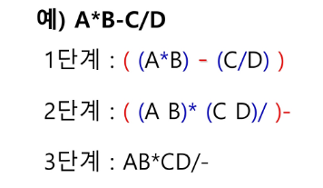

# Stack2 0808
## 계산기1
  1. 중위표기식의 후위표기식 변환 방법1
   - 수식의 각 연산자에 대해서 우선순위에 따라 괄호를 사용하여 다시 표현한다.
   - 각 연산자를 그에 대응하는 오른쪽 괄호의 뒤로 이동시킨다.
   - 괄호를 제거한다.
   - 

## 계산기2
  

## 백트래킹
- 백트래킹 기법은 해를 찾는 도중에 '막히면'(즉, 해가 아니면) 되돌아가서 다시 해를 찾아 가는 기법이다.
- 백트래킹 기법은 최적화 문제와 결정문제를 해결할 수 있다.
- 결정 문제: 문제의 조건을 만족하는 해가 존재하는지의 여부를 'yes' 또는 'no'를 답하는 문제 ( 미로 찾기, n-Queen 문제, Map coloring, 부분 집합의 합 문제 등)
  1. 백트래킹과 깊이우선탐색(DFS)과의 차이
   - 어떤 노드에서 출발하는 경로가 해결책으로 이어질 것 같지 않으면 더 이상 그 경로를 따라가지 않음으로써 시도의 횟수를 줄임.(Prunning 가지치기)
   - 깊이 우선탐색이 모든 경로를 추적하는데 비해 백트래킹은 불필요한 경로를 조기에 차단
   - 깊이우선탐색을 가하기에는 경우의 수가 너무나 많음. 즉, N!가지의 경우의 수를 가진 문제에 대해 깊이우선탐색을 가하면 당연히 처리 불가능한 문제
   - 백트래킹 알고리즘을 적용하면 일반적으로 경우의 수가 줄어들지만 이 역시 최악의 경우에는 여전히 지수함수 시간을 요하므로 처리 불가능.
  2. 백트래킹 기법
   - 모든 후보를 검사? : No
   - 어떤 노드의 유망성을 점검한 후에 유망(promising)하지 않다고 결정되면 그 노드의 부모로 되돌아가(backtracking) 다음 자식 노드로 감
   - 어떤 노드를 방문하였을 때 그 노드를 포함한 경로가 해답이 될 수 없으면 그 노드는 유망하지 않다고 하며, 반대로 해답의 가능성이 있으면 유망하다고 한다.
   - 가지치기(pruning): 유망하지 않는 노드가 포함되는 경로는 더 이상 고려하지 않는다.

  3. 백트래킹을 이용한 알고리즘의 절차
   - 상태 공간 트리의 깊이 우선 검색을 실시한다.
   - 각 노드가 유망한지를 점검한다.
   - 만일 그 노드가 유망하지 않으면, 그 노드의 부모 노드로 돌아가서 검색을 계속한다.
# 조합
```python
  arr = ['A', 'B', 'C', 'D', 'E']

  for a in range(5):
      start1 = a + 1
      for b in range(start1, 5):
          start2 = b + 1
          for c in range(start2, 5)
              print(arr[a], arr[b], [arr[c])
  
  # 5명 중에 n명 뽑는다
  # branch = 5
  # level = n

  arr = ['A', 'B', 'C', 'D', 'E']
  path = []
  # 3명 뽑는다
  n = 3
  def run(lev, start):
      if lev == n:
          print(path)
          return

      for i in range(start, 5):
          path.append(arr[i])
          run(lev + 1, i + 1)
          path.pop()
  run(0, 0)
```
## 부분집합
  1. powerset을 구하는 백트래킹 알고리즘
   ```python
   def backtrack(a, k, n): # a주어진 배열, k 결정할 원소, n 원소의 개수
    c = [0] * MAXCANDIDATES

    if k==n:
        process_solution(a, k) # 답이면 원하는 작업을 한다
    else:
        ncandidates = construct_candidates(a,k,n,c)
        for i in range(ncandidates):
            a[k] = c[i]
            backtrack(a, k+1, n)

  def construct_candidates(a,k,n,c):
      c[0] = True
      c[1] = False
      return 2

  def process_solution(a, k):
      for i in range(k):
          if a[i]:
              print(num[i], end=' ')
      print()

  MAXCANDIDATES = 2
  NMAX = 4
  a = [0] *NMAX
  num = [1, 2, 3, 4]
  backtrack(a, 0, NMAX) 
  ''' 
  1 2 3 4 
  1 2 3 
  1 2 4 
  1 2 
  1 3 4 
  1 3 
  1 4 
  1 
  2 3 4 
  2 3 
  2 4 
  2 
  3 4 
  3 
  4 
  공집합 포함해서 16개 출력. 2**n개
  '''
  ```
```python
# 부분집합의 합이 s인 것의 갯수 구하기.
def count_subsets(nums, S, N):
    count = 0
    # 1 << N 은 2^N 이므로 n개의 원소가 있을 때 가능한 부분집합의 수를 나타낸다.
    for bitmask in range(1 << N):
        subset_sum = 0

        # 비트마스크의 각 비트에 대해 해당 원소를 부분집합에 포함할지 결정한다.
        for i in range(N):
            if bitmask & (1 << i):
                subset_sum += nums[i]

        # 부분집합의 합이 목표값과 같다면 카운트를 증가시킨다.
        if subset_sum == S:
            count += 1

    return count
```

```python
# itertools를 사용한 부분집합 / 부분집합의 합이 s인 것의 갯수 구하기.
import itertools

t = int(input())
for tc in range(1, t+1):

    n, s = map(int, input().split())
    arr = list(map(int, input().split()))
    cnt = 0
    for i in range(len(arr)+1):
        subsets = list(itertools.combinations(arr, i))
        for subset in subsets:
            if sum(subset) == s:
                cnt += 1
```

