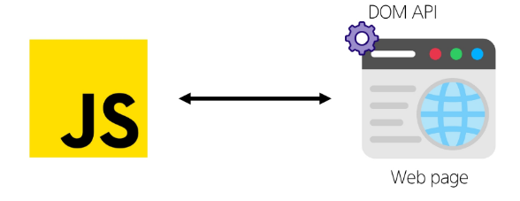
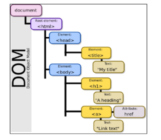
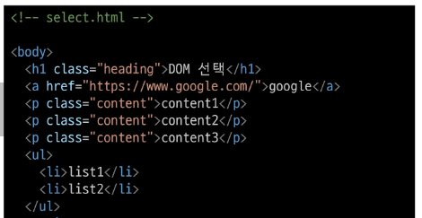
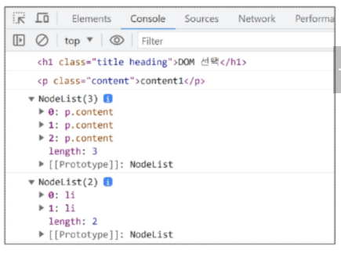
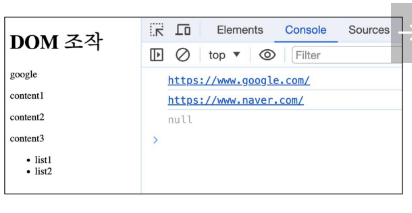
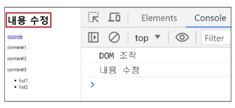
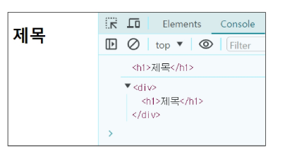
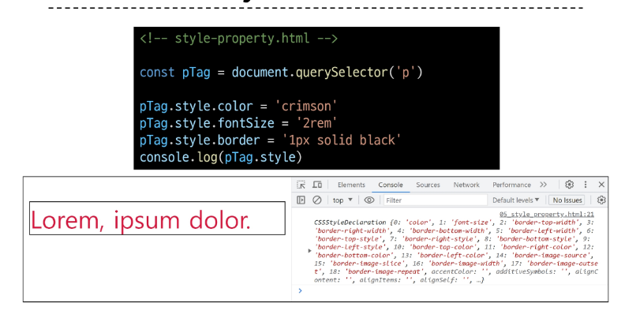

## ECMAScript
- ECma international이 정의하고 있는 표준화된 스크립트 프로그래밍 언어 명세
- **스크립트 언어가 준수해야 하는 규칙, 세부사항 등을 제공**
- ECMAScript는 JavaScript의 표준이며, JavaScript는 ECMAScript 표준을 따르는 구체적인 프로그래밍 언어

## 식별자(변수명) 작성 규칙
- 반드시 문자, 달러('$') 또는 밑줄('_')로 시작
- 대소문자를 구분
- 예약어 사용 불가 - for, if, function 등

# 변수

## let
- 블록 스코프(block scope)를 갖는 지역 변수를 선언
- **재할당 가능**
- **재선언 불가능** 
```
let number = 10 // 1. 선언 및 초기값 할당
number = 20 // 2. 재할당

let number = 10 // 1. 선언 및 초기값 할당
let number = 20 // 2. 재선언 불가능 
```

## const
- 블록 스코프를 갖는 지역 변수를 선언
- **재할당 불가능**
- **재선언 불가능**
```
const number = 10   // 1. 선언 및 초기값 할당
number = 10         // 2. 재할당 불가능

const number = 10   // 1. 선언 및 초기값 할당
const number = 20   // 2. 재선언 불가능

const number        // 선언시 반드시 초기값 설정 필요
```

## 블록 스코프(block scope)
- if, for, 함수 등의 '중괄호({}) 내부'를 가리킴
- 블록 스코프를 가지는 변수는 블록 바깥에서 접근 불가능
```
let x = 1

if (x==1){
  let x = 2

  console.log(x)  // 2
}

console.log(x)    //1
```

## 어떤 변수 선언 키워드를 사용해야 할까?
- const를 기본으로 사용
- 필요한 경우에만 let으로 전환
  - 재할당이 필요한 경우
  - let을 사용하는 것은 해당변수가 의도적으로 변경될 수 있음을 명확히 나타냄
  - 코드의 유연성을 확보하면서도 const의 장점을 최대한 활용할 수 있음
<br/>

**const를 기본으로 사용해야 하는 이유**
- 코드의 의도 명확화
- 버그 예방

 # DOM (The Document Object Model)
 - 웹 페이지(Document)를 구조화된 객체로 제공하여 프로그래밍 언어가 페이지 구조에 접근할 수 있는 방법을 제공
 - **문서 구조, 스타일, 내용 등을 변경할 수 있도록 함**

## DOM API
- 다른 프로그래밍 언어가 웹 페이지에 접근 및 조작할 수 있도록 페이지 요소들을 객체 형태로 제공하며 이에 따른 메서드 또한 제공
- 

### DOM 특징
- DOM에서 모든 요소, 속성, 텍스트는 하나의 객체
- 모두 document 객체의 하위 객체로 구성됨.
- 

### DOM 핵심
- 문서의 요소들을 객체로 제공하여 다른 프로그래밍 언어에서 접근하고 조작할 수 있는 방법을 제공하는 API

## document 객체
- 웹 페이지 객체
- DOM Tree의 진입점
- 페이지를 구성하는 모든 객체 요소를 포함

## DOM 조작시 기억해야 할 것
- 조작 순서
  - 1. 조작하고자 하는 요소를 **선택**
  - 2. 선택된 요소의 콘텐츠 또는 속성을 **조작**

## 선택 메서드
- document.querySelector() : 요소 한 개 선택
- document.querySelectorAll(): 요소 여러 개 선택


### document.**querySelector(selector)**
- 제공한 선택자와 일치하는 element 한 개 선택
- 제공한 선택자를 만족하는 첫 번째 element 객체를 반환(없다면 null 반환)

### document.**querySelectorAll(selector)**
- 제공한 선택자와 일치하는 여러 element를 선택
- 제공한 선택자를 만족하는 NodeList를 반환

### DOM 선택 실습

```
<script>
  console.log(document.querySelector('.heading))
  console.log(document.querySelector('.content))
  console.log(document.querySelectorAll('.content))
  console.log(document.querySelectorAll('ul > li'))
</script>
```
결과


## DON 조작
1. 속성(attribute) 조작
   - 클래스 속성 조작
   - 일반 속성 조작
2. HTML 콘텐츠 조작
3. DOM 요소 조작
4. 스타일 조작

## 클래스 속성 조작
**'classList' property** 
- 요소의 클래스 목록을 DOM TokenList(유사 배열)형태로 반환

### 1. classList 메서드
- element.classList.add(): 지정한 클래스 값을 추가
- element.classList.remove(): 지정한 클래스 값을 제거
- element.classList.toggle(): 클래스가 존재한다면 제거하고 false를 반환 (존재하지 않으면 클래스를 추가하고 true를 반환)

#### 클래스 속성 조작 실습
- add()와 remove() 메서드를 사용해 지정한 클래스 값을 추가 혹은 제거
```
const h1Tag = document.querySelector('.hedding')

h1Tag.classList.add('red)   // 해당 요소가 빨간 글씨로 나옴

h1Tag.classList.remove('red')

h1Tag.classList.toggle('red')   // 해당 클래스('red')있으면 false 반환 없으면 red추가.
```

### 2. 일반 속성 조작 메서드
- element.getAttribute(): 해당 요소에 지정된 값을 반환(조회)
- element.setAttribute(name, value):
  - 지정된 요소의 속성 값을 설정
  - 속성이 이미 있으면 기존 값을 갱신(그렇지 않으면 지정된 이름과 값으로 새 속성이 추가)  
- element.removeAttribute(): 요소에서 지정된 이름을 가진 속성 제거

#### 일반 속성 조작 실습
```
const aTag = document.querySelector('a')
console.log(aTag.getAttribute('href))

aTag.setAttribute('href', 'https://www.naver.com/')
console.log(aTag.getAttribute('href'))

aTag.removeAttribute('href')
console.log(aTag.getAttribute('href'))

```
- 결과 

## HTML 콘텐츠 조작
**'textContent' property**
- 요소의 텍스트 콘텐츠를 표현 `<p> lorem <p/>`

**HTML 콘텐츠 조작 실습**
```
const h1Tag = document.querySelector('.heading')
console.log(h1Tag.textContent)

h1Tag.textContent = '내용수정'
console.log(h1Tag.textContent)

```
- 결과 

## DOM 요소 조작
- document.createElement(tagName): 작성한 tagName의 HTML 요소를 생성하여 반환
- Node.appendChild():
  - 한 Node를 특정 부모 Node의 자식 NodeList중 마지막 자식으로 삽입
  - 추가된 Node 객체를 반환
- Node.removeChild():
  - DOM에서 자식 Node를 제거
  - 제거된 Node를 반환

#### DOM 요소 조작 실습
```
// 생성
const h1Tag = document.createElement('h1')
h1Tag.textContent = '제목'
console.log(h1Tag)

// 추가
const divTag = document.querySelector('div')
divTag.appendChild(h1Tag)
console.log(divTag)

// 삭제
const pTag = document.querySelector('p')
divTag.removeChild(pTag)
```
- 결과 

## Style 조작
