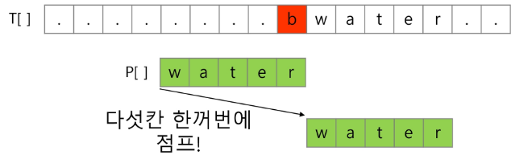
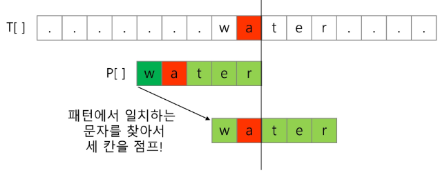
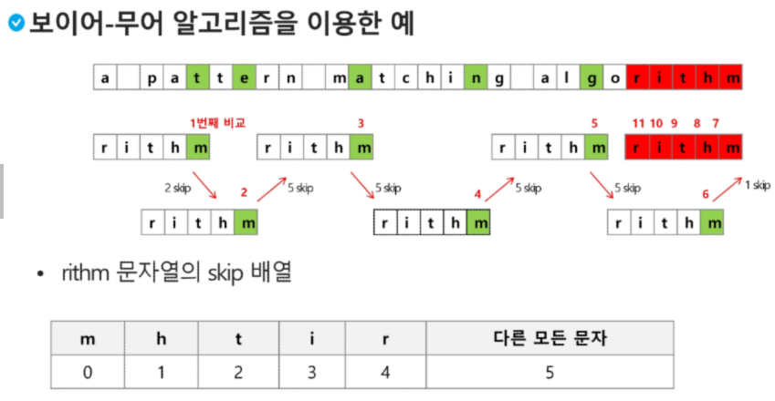

# 알고리즘 및 프로그래밍 개념 정리

## 1. 정렬 알고리즘

### 카운팅 정렬
- 항목들의 순서를 결정하기 위해 집합에 각 항목이 몇 개씩 잇는지 세는 작업을 하여, 선형 시간에 정렬하는 효율적인 알고리즘
- 시간복잡도: O(n+k) / n은 리스트의 길이, k는 정수의 최댓값
```python
numbers = [1, 4, 1, 2, 7, 5, 2]

def counting(arr):
    max_v = float('-inf')
    for num in arr:
        if num > max_v:
            max_v = num
    count = [0] * (max_v + 1)

    for num in arr:
        count[num] += 1

    sorted_arr = []
    for i in range(len(count)):
        for j in range(count[i]):
            sorted_arr.append(i)

    return sorted_arr

result = counting(numbers)
print(result)
```

### 버블 정렬
- **버블 정렬**은 인접한 원소들을 비교하여 정렬하는 간단한 정렬 알고리즘 시간복잡도: O(n^2)
```python
def BubbleSort(a,N):    #정렬할 List, N 원소수
    for i in range(N-1,0,-1):   #범위의 끝 위치
        for j in range(0,i):    #비교할 왼쪽 원소
            if a[j] > a[j+1]:
                a[j], a[j+1] = a[j+1], a[j]
```

### Baby-gin Game
 - 0~9 사이의 숫자 카드에서 임의의 카드 6장을 뽑았을 때, 3장의 카드가 연속적인 번호를 갖는경우를 run이라 하고, 3장의 카드가 동일한번호를 갖는 경우를 triplet이라고 한다.
 - 6장의 카드가 run과 triplet로만 구성된 경우를 baby-gin으로 부른다.
 ```python
 num = 456789
c=[0]*12
for i in range(6):
    c[num%10] += 1
    num//=10

i = 0
tri = run = 0
while i < 10:
    if c[i] >=3:
        c[i] -=3
        tri +=1
        continue
    if c[i] >= 1 and c[i+1] >= 1 and c[i+2] >=1 :
        c[i] -=1
        c[i+1] -=1
        c[i+2] -=1
        run +=1
        continue
    i +=1

if run+tri ==2: print("Baby Gin")
else: print('Lose')        
```
## 2. 순열과 조합

### 순열
```python
import itertools

lst = [1, 2, 3]
print(list(itertools.permutations(lst)))
```

### 조합
```python
import itertools

lst = [1, 2, 3]
print(list(itertools.combinations(lst, 2)))
```

## 3. 탐욕 알고리즘
- 여러 경우 중 하나를 결정해야 할 때마다 그 순간에 최적이라고 생각되는 것을 선택해 나가는 방식으로 진행하여 최종적인 해답에 도달한다.
### 거스름돈 문제
```python
def greedy(money, coins):
    coins.sort(reverse=True)
    change = {coin: 0 for coin in coins}
    for coin in coins:
        while money >= coin:
            money -= coin
            change[coin] += 1
    return change

result = greedy(380, [100, 50, 10])
print(result)
```

## 4. 리스트 순회

### 지그재그 순회
```python
# i 행의 좌표
# j 열의 좌표
for i in range(n):
    for j in range(m):
        f(array[i][j+(m-1-2*j) * (i%2)])
```
### 2차원 배열 (우, 하, 좌, 상) 순회
```python
n = int(input())
arr = [list(map(int, input().split())) for _ in range(n)]

di = [0, 1, 0, -1]
dj = [1, 0, -1, 0]

total = 0

for i in range(n):
    for j in range(n):
        s = 0
        for k in range(4):
            ni = i + di[k]
            nj = j + dj[k]
            if 0 <= ni < n and 0 <= nj < n:
                s += abs(arr[i][j] - arr[ni][nj])
        total += s

print(total)
```
### 2차원 배열의 활용

## 5. 부분집합 생성

### 조합을 이용한 부분집합
```python
import itertools

lst = [1, 2, 3]
ans1 = list(itertools.permutations(lst))
ans2 = list(itertools.combinations(lst, 2))
print(ans1)
print(ans2)
```

### 비트 연산을 이용한 부분집합
```python
T = int(input())
for tc in range(1, T + 1):
    N, K = map(int, input().split())
    lst = [i for i in range(1, 13)]
    cnt = 0

    for i in range(1 << 12):
        sum_sub = 0
        subset = []
        for j in range(12):
            if i & (1 << j):
                sum_sub += lst[j]
                subset.append(lst[j])
        if sum_sub == K and len(subset) == N:
            cnt += 1

    print(f'#{tc} {cnt}')
```
### 부분집합 의 합 D3
- 1부터 12까지의 숫자를 원소로 가진 집합 A가 있다. 집합 A의 부분 집합 중 N개의 원소를 갖고 있고, 원소의 합이 K인 부분집합의 개수를 출력하는 프로그램을 작성하시오.

- 해당하는 부분집합이 없는 경우 0을 출력한다. 모든 부분 집합을 만들어 답을 찾아도 된다.
 

- 예를 들어 N = 3, K = 6 경우, 부분집합은 { 1, 2, 3 } 경우 1가지가 존재한다.
```python
T = int(input())
 
for tc in range(1, T + 1):
    arr = [i for i in range(1, 13)]
    n, k = map(int, input().split())
 
    len_arr = len(arr)
    cnt = 0
 
    # 모든 부분 집합을 생성하고 검사
    for i in range(1 << len_arr):  # 2^len_arr 부분 집합 생성
        subset = []
        for j in range(len_arr):
            if i & (1 << j):  # j번째 원소가 부분 집합에 포함된 경우
                subset.append(arr[j])
 
        if len(subset) == n and sum(subset) == k:
            cnt += 1
 
    print(f'#{tc} {cnt}')
```    
## 6. 검색 알고리즘

### 순차 검색
- **순차 검색**은 배열의 처음부터 끝까지 검색하여 원하는 값을 찾는 방법입니다.

### 이진 검색
```python
def binarySearch(a, N, key):
    start = 0
    end = N - 1
    while start <= end:
        middle = (start + end) // 2
        if a[middle] == key:
            return True
        elif a[middle] > key:
            end = middle - 1
        else:
            start = middle + 1
    return False
```
### 일반적인 셀렉션 알고리즘


## 7. 정렬 알고리즘

### 선택 정렬
```python
def selectionSort(a, N):
    for i in range(N - 1):
        min_idx = i
        for j in range(i + 1, N):
            if a[min_idx] > a[j]:
                min_idx = j
        a[i], a[min_idx] = a[min_idx], a[i]
```

## 8. 비트 연산자

- **AND**: `&` - 비트 단위로 AND 연산
- **OR**: `|` - 비트 단위로 OR 연산
- **왼쪽 이동**: `<<` - 비트를 왼쪽으로 이동
- **오른쪽 이동**: `>>` - 비트를 오른쪽으로 이동

## 9. String
### 문자열 숫자를 정수로 변환하기
- int()와 같은 atoi()함수 만들기
s = '123'
a = atoi(s)
print(a+1)
```python
def atoi(s):
    i = 0
    for x in s:
        i = i*10 + ord(x)-ord('0')
    return i    
```

### 기타 유용한 문자열 메서드

- **`split()`**: 문자열을 나누어 리스트로 반환
- **`strip()`**: 문자열의 양쪽 공백 제거
- **`lstrip()`**, **`rstrip()`**: 문자열의 왼쪽, 오른쪽 공백 제거
- **`replace()`**: 문자열의 특정 부분을 다른 부분으로 교체
- **`join()`**: 리스트의 문자열을 특정 구분자로 연결
- **`find()`**, **`index()`**: 문자열 내에서 특정 부분의 위치 찾기
- **`isdigit()`**, **`isalpha()`**, **`isalnum()`**: 문자열이 숫자, 알파벳, 또는 둘 다로 이루어져 있는지 확인

## 10. 아스키 코드

- 대문자 A: 65
- 소문자 a: 97
- 공백(space)도 아스키 코드값이 있음

## 11. 회문 검사

- **회문**: 문자열이 좌우 대칭인지 확인
```python
string = "racecar"
is_palindrome = string == string[::-1]
```

# 0805 summary

## 고지식한 패턴 매칭
```python
p = "is" # 찾을 패턴
t = "This is a book~!" # 전체 텍스트
M = len(p) # 찾을 패턴의 길이
N = len(t) # 전체 텍스트의 길이

def BruteForce(p, t):
    i = 0 # t의 인덱스
    j = 0 # p의 인덱스
    while j < M and i < N:
        if t[i] != p[j]:
            i = i-j
            j = -1
        i = i + 1
        j = j + 1
        if j == M : return i -M # 검색 성공
        else: return -1    # 검색 실패
```
```python
t = 'TTTTTABC'
p = 'TTA'
N = len(t)
M = len(p)
cnt = 0
for i in range(N-M+1):
    for j in range(M):
        if t[i + j] != p[j]:
            break   # for j, 다음 글자부터 비교 시작
    else:       # for j 가 증단없이 반복되면 (for, else문)
        cnt += 1    # 패턴 개수 1 증가
print(cnt)  # 1
```
- 고지식한 패턴 검색 알고리즘의 시간 복잡도
- 최악의 경우 시간 복잡도는 텍스트의 모든 위치에서 패턴을 비교해야 하므로 O(MN)이 됨.

## KMP알고리즘
- 불일치가 발생한 텍스트 스트링의 앞 부분에 어떤 문자가 있는지를 미리 알고 있으므로, 불일치가 발생한 앞 부분에 대하여 다시 비교하지 않고 매칭을 수행
- 패턴을 전처리하여 배열 Next[M]을 구해서 잘못된 시작을 최소화함.
- 시간 복잡도: O(M+N)
```python
def kmp(t, p):
    N = len(t)
    M = len(p)
    lps = [0] * (M+1)
    j = 0   # 일치한 개수 == 비교할 패턴 위치
    lps[0] = -1
    for i in range(1, M):
        lps[i] == j
        if p[i] == p[j]:
            j += 1
        else:
            j = 0
    lps[M] = j
    # search
    i = 0   # 비교할 텍스트 위치
    j = 0   # 비교할 패턴 위치
    while i < N and j <= M:
        if j == -1 or t[i] == p[j]: # 첫 글자가 불일치했거나, 일치하면
            i += 1
            j += 1
        else:   # 불일치
            j = lps[j]
        if j == M:  # 패턴을 찾을 경우
            print(i-M, end=' ') # 패턴의 인덱스 출력
            j = lps[j]                
    print()
    return

t = 'zzzabcdabcdabcefabcd'
p = 'abcdabcef'
kmp(t, p)
t = 'AABAACAADAABAABA'
p = 'AABA'
kmp(t, p)
t = 'AAAAABAAABA'
p = 'AAAA'
kmp(t, p)

```
## 보이어 무어 알고리즘
- 오른쪽에서 왼쪽으로 비교
- 대부분의 상용 소프트웨어에서 채택하고 있는 알고리즘
- 보이어-무어 알고리즘은 패턴에 오른쪽 끝에 있는 문자가 불일치 하고 이 문자가 패턴 내에 존재하지 않는 경우, 이동 거리는 무려 패턴의 길이 만큼이 된다.
  
  
  
- 구현은 하지 않을 것 (이런게 있다 정도로만 일단 알고 있기.)

### 문자열 매칭 알고리즘 비교
- 찾고자 하는 문자열 패턴의 길이: m, 총 문자열 길이 n
- 고지식한 패턴 검색 알고리즘: 수행시간 O(mn)
- kmp 알고리즘 : 수행시간 O(n)
- 보이어 무어 : 최악의 경우 수행시간 O(mn) 